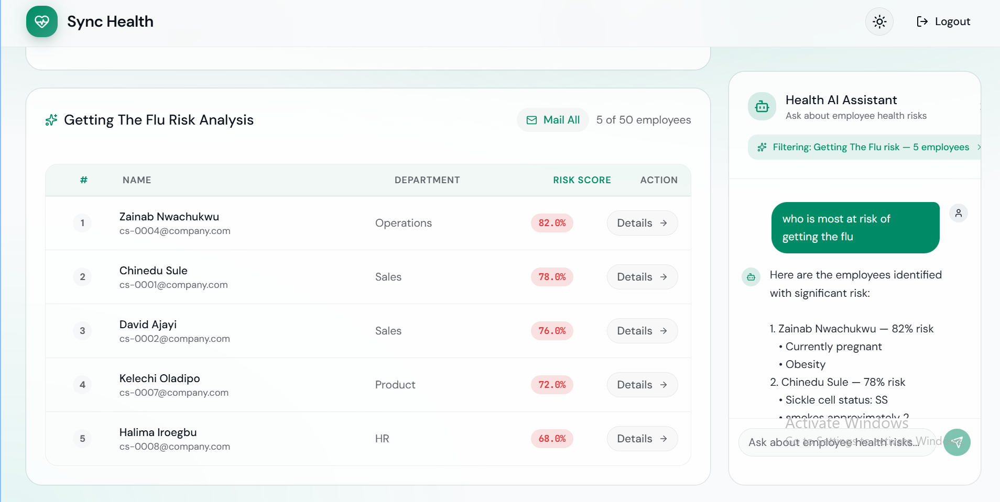

# Sync Health

Frontend for the corporate disease risk prediction and prevention platform.

### **Kindly Note:** For ease of development, task splitting and hosting, the backend was developed in a separate repo. Please view it [here.](https://github.com/AJ-505/sync-health-backend)

## Video Demo
[](sync-health-video.mp4)

## Demo Login

To quickly try the app, use the demo credentials shown on the login page:

- Email/username: `jennie@chowstack.ng`
- Password: `ChangeMe!2026`

## Core Features

- Employee registry with health profile and demographic context.
- Smart filtering by age, department, weight, gender, and search.
- Disease risk assessment for hypertension, diabetes, and cardiovascular risk.
- AI-assisted risk analysis that can rank relevant employees in the dashboard.
- Direct outreach actions, including contextual email drafts for selected at-risk groups.

## Tech Stack

- React 19 + TypeScript
- Vite
- React Router
- TanStack Query
- Tailwind CSS
- shadcn/base-ui components
- ESLint

## Prerequisites

- Node.js 20+
- `pnpm` (required package manager)

## Getting Started

1. Install dependencies:

```bash
pnpm install
```

2. Create `.env` and set backend URL:

```bash
VITE_PUBLIC_BACKEND_URL=https://sync-health-backend-production.up.railway.app
```

3. Start development server:

```bash
pnpm dev
```

App runs on the Vite dev URL shown in terminal (usually `http://localhost:5173`).

## Available Scripts

- `pnpm dev` - Start local dev server
- `pnpm build` - Type-check and create production build
- `pnpm lint` - Run ESLint
- `pnpm preview` - Preview production build locally

## API Contract Notes

This frontend is aligned with the FastAPI OpenAPI contract provided for:

- `POST /auth/register`
- `POST /auth/login`
- `GET /filter/employees`
- `GET /filter/employees/all`
